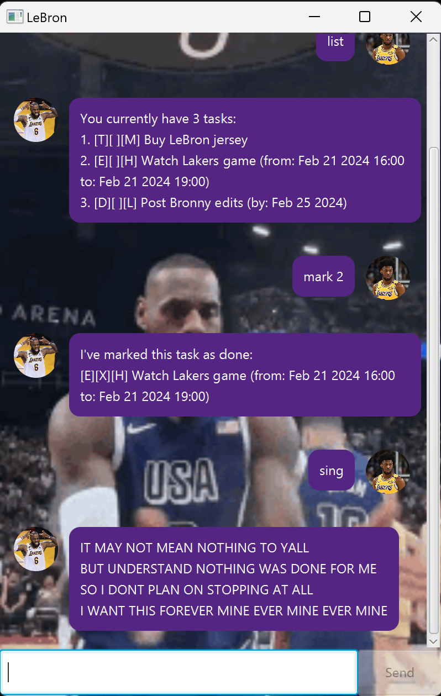

# 👑 LeBron - CLI Task Management ChatBot

## 🐐 Overview



The GOAT LeBron James is here to help you manage and prioritise your tasks and daily activities!

Simply add your tasks, mark them as done, remove them or list them to see your upcoming
tasks, deadlines and events using a simple set of commands!

Occasionally, LeBron may even sing for you!

## 🌟 Features

### ℹ️ Notes on Command Format
```
Priority Labels:
Low - l
Medium - m
High - h

Date/Date-Time Format:
Date - yyyy-MM-dd (eg. 2024-02-18)
Date-Time - yyyy-MM-dd (eg. 2024-02-20 1800)
```

- **Add Tasks**: Create Todo, Deadline and Event tasks and tag priority labels to them
  ```
  Format:
  todo [priority] [description]
  deadline [priority] [description] /by [date]
  event [priority] [description] /[date-time] /[date-time]
  
  Examples:
  todo h Buy LeBron jersey
  deadline l Post LeBron edits /by 2024-02-18
  event m Watch Lakers game /2024-02-20 1800 /2024-02-20 2100
  ```

- **List Tasks**: See pending tasks, deadlines and events
  ```
  Format:
  list
  ```

- **Mark Tasks**: Mark or unmark tasks as done
  ```
  Format:
  mark [taskNumber]
  unmark [taskNumber]
  
  Examples:
  mark 1
  unmark 3
  ```

- **Delete Tasks**: Remove tasks
  ```
  Format:
  delete [taskNumber]
  
  Example:
  delete 2
  ```

- **Find Tasks**: Find tasks with specified keyword
  ```
  Format:
  find [keyword]
  
  Example:
  find Bronny
  ```

- **Exit and Save Tasks**: Exit the chatbot and save logged tasks
  ```
  Format:
  bye
  ```
### 🎤 Easter Egg

- LeBron may sometimes sing if he's in the mood. Try to find the command that does so!